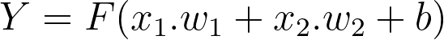
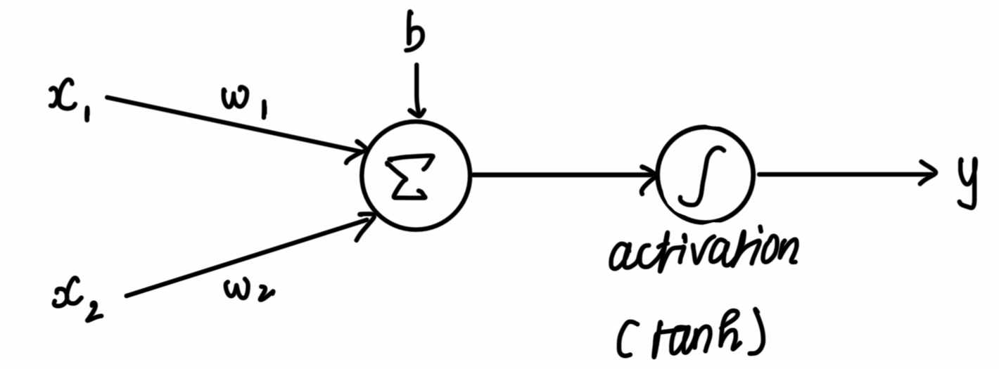
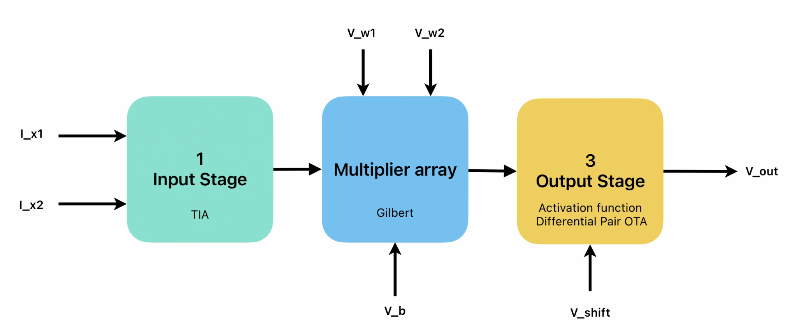
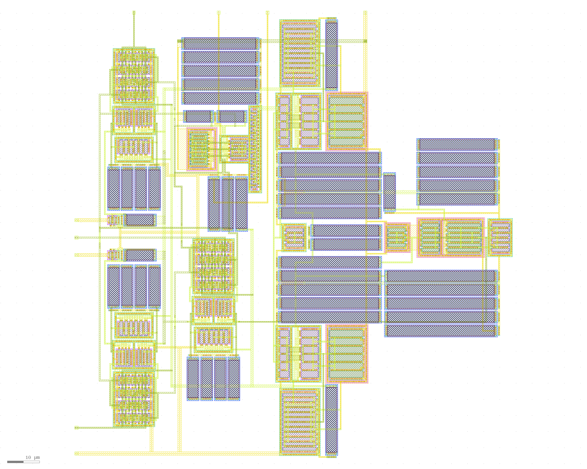
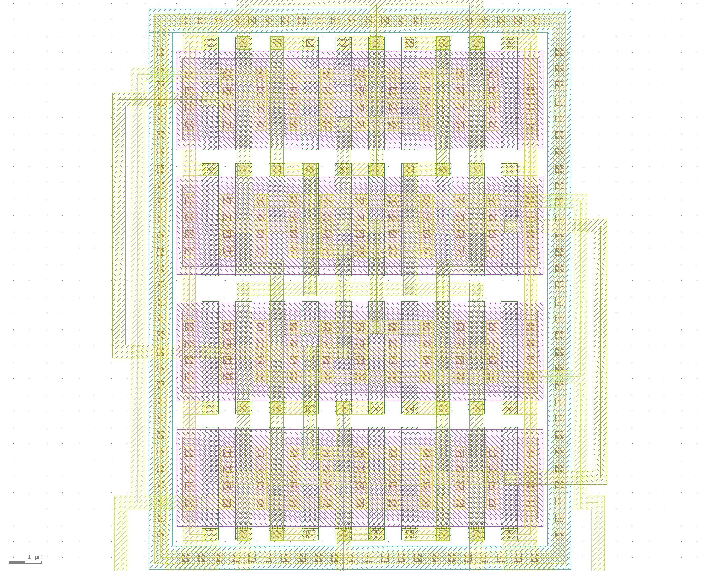

# Programmable Analog Perceptron

(this repo is in WIP state - Layout information needs to be added in readmes..)

## Goal

This project is made by utilizing GF180mcu PDK, for the 2026 SSCS PICO Chipathon. Objective primarily is to learn, and tapeout if possible.
(Update : This layout was selected for the tapeout in SSCS PICO Chipathon 2026 as 1 of the 16 projects (4 chips) to be fabricated!)


## Overview

A single perceptron in the analog (continuous time) domain, where its weights and biases are programmable. Intended operation is in DC mode, and sensor agnostic as long as it is a current mode sensor. Designed with photodiodes in mind. Basically analog computation, where the computation performed is :




Where,

* F is the activation function (tanh/sigmoid) 
* X1, X2 are input sensor currents (pull down)
* W1, W2 are input weights (voltages) <- “Programmable”
* B is the bias (voltage)
* Y is the output voltage



Highlight is that there is no digital, memory elements. The calculation happens as fast it can. As in, the time taken, intuitively, is the time taken for an input impulse to form a respective output impulse response. All while maintaining the full "analog" resolution. In contrast, a typical digital circuit would take a MAC operation(s) with a delay to perform it, and would be limited to the precision it has. Not to mention the involvment of ADC, DAC in such a digital circuit, causing overhead.

### High level block details



* Transimpedance amplifier (TIA) (x2) converts sensor currents to voltage. (I → V)
* An array of Gilbert multipliers (x3) multiplies those voltages with the weights. Outputs current (V→I) 
* Using Kirchhoff's Current Law (KCL) Output Currents are summed from each multiplier.
* A Differential Pair in Operational Transconductance Amplifier (OTA) naturally squeezes the output in a tanh / square law shape for activation function.


## Repository Structure

Main overview of the structure of this repository

* [`docs/images`](docs/images/): Contains some images for this README.
* [`gds/`](gds/): Contains ready for tapeout GDS Files from klayout
* [`layout/`](layout/): Contains Layout (gds) files from klayout
  * [`layout/visual/`](layout/visual/): Contains images of the layout
* [`lvs/`](lvs/):
  * [`lvs/lvs_config.json`]('lvs/lvs_config.json'): lvs configuration for chipathon integration
  * [`lvs/schematics/`]('lvs/schematics/'): xschem schematics with dummy transistors for lvs
  * [`lvs/spice/`]('lvs/spice/'): xschem generated netlist of sch, for lvs in klayout.
* [`plots/`](plots/): Simulation sweep data and generated figures
   * [`plots/plot_results.py`](plots/plot_results.py): Script that generates all figures from sweep data
   * `plots/*.txt`: Raw ngspice sweep outputs (which are parsed by matplotlib)
   * [`plots/plots_generated/`](plots/plots_generated/): Plots generated from xschem via matplotlib (python)
   * [`plots/plots_real_generated/`](plots/plots_real_generated/): Plots generated from xschem via matplotlib (python), using realistic tb.
   * [`plots/opsweep_generated/`](plots/opsweep_generated/): Op-sweep Plots generated from xschem via matplotlib (python).
* [`schematics/`](schematics/): Xschem sources and testbenches for all blocks
   * [`schematics/cg_amp_tia.sch`](schematics/cg_amp_tia.sch): CG-amp shunt-feedback TIA
   * [`schematics/gilbert_multiplier.sch`](schematics/gilbert_multiplier.sch) / [`gilbert_multiplier_current.sch`](schematics/gilbert_multiplier_current.sch): Gilbert cell multiplier (voltage-mode and current-mode variants)
   * [`schematics/tanh_ota.sch`](schematics/tanh_ota.sch): Differential amplifier sigmoid/tanh stage
   * [`schematics/perceptron_core.sch`](schematics/perceptron_core.sch): Perceptron top core chip.
   * [`schematics/perceptron.sch`](schematics/perceptron.sch): Top-level perceptron integration (with ESD cells)
   * `schematics/tb_*.sch`: Testbenches for each block above
   * [`schematics/diagrams/`](schematics/diagrams/): Exported block/testbench diagrams
   * [`schematics/io_secondary_5p0.sch`](schematics/io_secondary_5p0.sch) : ESD Cell , from [sscs-chipathon-2026](https://github.com/sscs-ose/sscs-chipathon-2026/blob/main/resources/Integration/Chipathon2025_pads/xschem/symbols/io_secondary_5p0/io_secondary_5p0.sch)
   * [`schematics/io_asig_5p0.sch`](schematics/io_asig_5p0.sch) : Pad sch , from [sscs-chipathon-2026](https://github.com/sscs-ose/sscs-chipathon-2026/tree/main/resources/Integration/Chipathon2025_pads/xschem)
   * [`schematics/gf180mcu_fd_io__asig_5p0_extracted.spice`](schematics/gf180mcu_fd_io__asig_5p0_extracted.spice) : Pad extracted spice , from [sscs-chipathon-2026](https://github.com/sscs-ose/sscs-chipathon-2026/tree/main/resources/Integration/Chipathon2025_pads/xschem)
 

## Cool Images

### Perceptron Core Chip (Excludes ESD)



Area : 135.81 x 138.87 (Width x Height) 


### 4 row , 10 column Common Centroid Layout <- I think this is cool
```
XABBAABBAX

XDCCDDCCDX

XCDDCCDDCX

XBAABBAABX
```


## Chipathon Documents & Related

### Main
- [Github repo (this repo)](https://github.com/valrek-sol/analog-perceptron-gf180mcu)
- [Google Drive containing all below material](https://drive.google.com/drive/folders/1w9kNC-WTRVOlu-ZDq20NobVmB2Sa7vTh?usp=sharing)
- [Pin Requirement Link](https://docs.google.com/spreadsheets/d/1j0dq9UvAsj5zYBimwCMxk5xVtT9jLV9aKmREzxfqWbw/edit?usp=drive_link)
- [Progress tracker Link](https://docs.google.com/spreadsheets/d/1hsH6fOqgu6h7McnxBpZjmTYU_prxYtLpsWHi7i9b4Zk/edit?usp=sharing) 

### Proposal
- [Proposal Slide Link](https://docs.google.com/presentation/d/13eMg_GNvv0nm00do740fxi4ZR1RHCYNasZUUlCRyxGo/edit?usp=sharing)
- [Proposal Video Link](https://drive.google.com/file/d/1MZTpp1oeU_d-gKvnwnpxPWE7-ZTWUfAw/view?usp=drive_link)


### Schematics
- [Schematic Review Slide Link [Compacted]](https://docs.google.com/presentation/d/11Yxg_3VuQzDJLRQqG4vkzuTGyFlSRIocTLgW-DXF2V8/edit?usp=drive_link)
- [Schematic Review Slide Link [Full]](https://docs.google.com/presentation/d/1FTLqScoZ_3OFutOgfb5MBX5IrDTujoEfs5XRks5E18U/edit?usp=drive_link)
- [Schematic Review Video Link](https://drive.google.com/file/d/1bdpH2OENgyuMhEZ-BPgnGtmW76qQdRpw/view?usp=drive_link)

### Layout *[OUTDATED]*
- [Layout Review Slide Link [Compacted]](https://docs.google.com/presentation/d/1Vl2qHZKkCno4SRD6HPlMp9nMCjafCzIGljwKhNdG8Zw/edit?usp=drive_link)
- [Layout Review Slide Link [Full]](https://docs.google.com/presentation/d/1kXHrPeHg86iKGmTvl3Hp-W3wBCj_qAFPQV0FCUOQX8I/edit?usp=drive_link)
- [Layout Review Video Link](https://drive.google.com/file/d/1iXU2ButotYgvr9TDTM6fMiT9av6NSFTT/view?usp=drive_link)

### Layout *[NEW]*
- [Layout Review Slide Link](https://docs.google.com/presentation/d/1c07koU3RjxITC2LPe_R-P7QbhlM-Mnon6lzeOXfnkZY/edit?usp=sharing)
